# amazon-seller-filter-checker

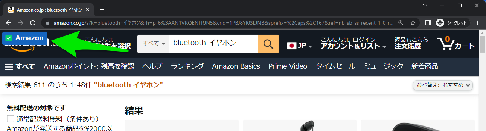

Amazonの検索ページにマーケットプレイス商品を除外・解除するボタンを追加したり、商品ページにサクラチェッカーの検索結果を開くボタンを追加するUserScriptです。

**UserScript URL**

```
https://raw.githubusercontent.com/motoacs/amazon-seller-filter-checker/master/amazon-seller-filter-checker.user.js
```


## 使い方

このユーザースクリプトを追加すると、Amazonの商品検索画面の左上に、マーケットプレイスの商品を除外するためのボタンが表示されます。ボタンをクリックするとページがリロードされ、Amazonが販売・発送する商品のみが表示されます。
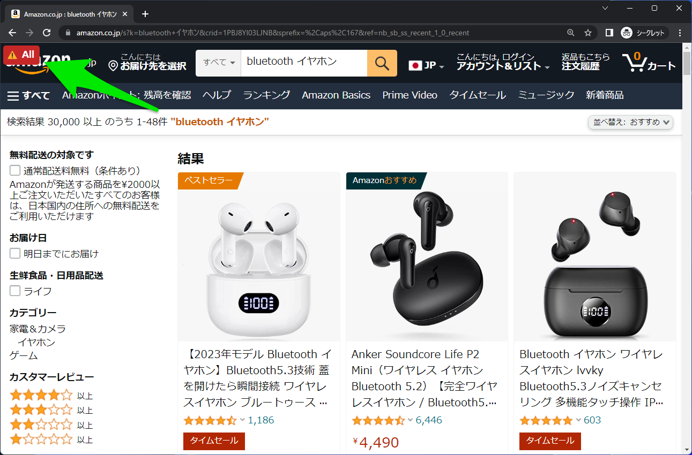


再び画面左上のボタンをクリックすると、マーケットプレイスを含めた標準の検索画面に戻ります。
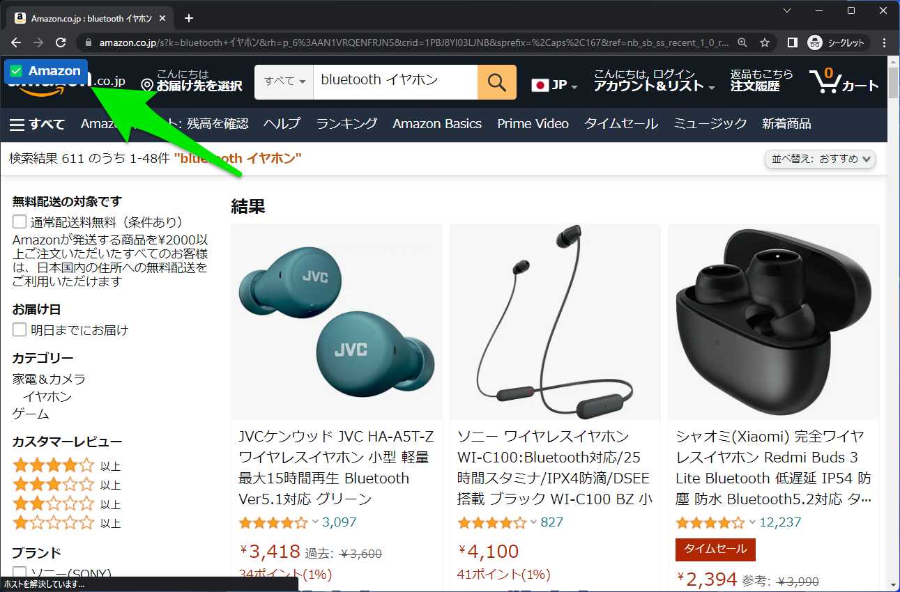


また各商品ページの左上に、表示中の商品を「サクラチェッカー」で検索するためのボタンが追加されます。
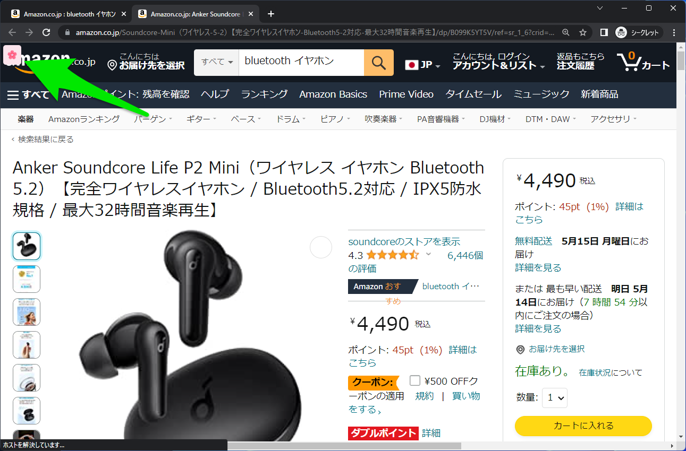


ボタンをクリックすると、新しいタブでサクラチェッカーが開きます。
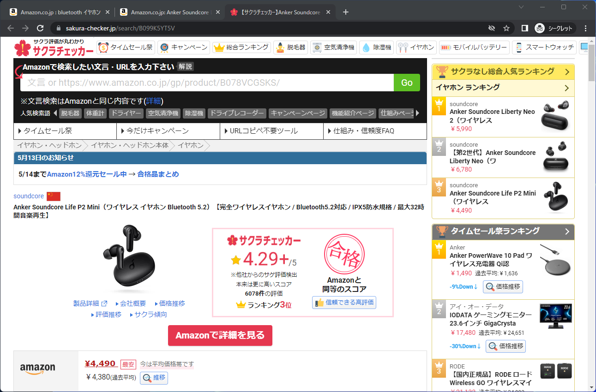


## インストール方法

このプログラムはブラウザ拡張機能ではなくユーザースクリプトです。別途、ブラウザ拡張機能「Tampermonkey」や、Windows版 AdGuardなどの、ユーザースクリプトを実行できるツールにインストールしてご使用ください。


### Tampermonkey

Chrome / Edge / Firefoxの拡張機能ストアから、[Tampermonkey](https://www.tampermonkey.net/) をインストールします。
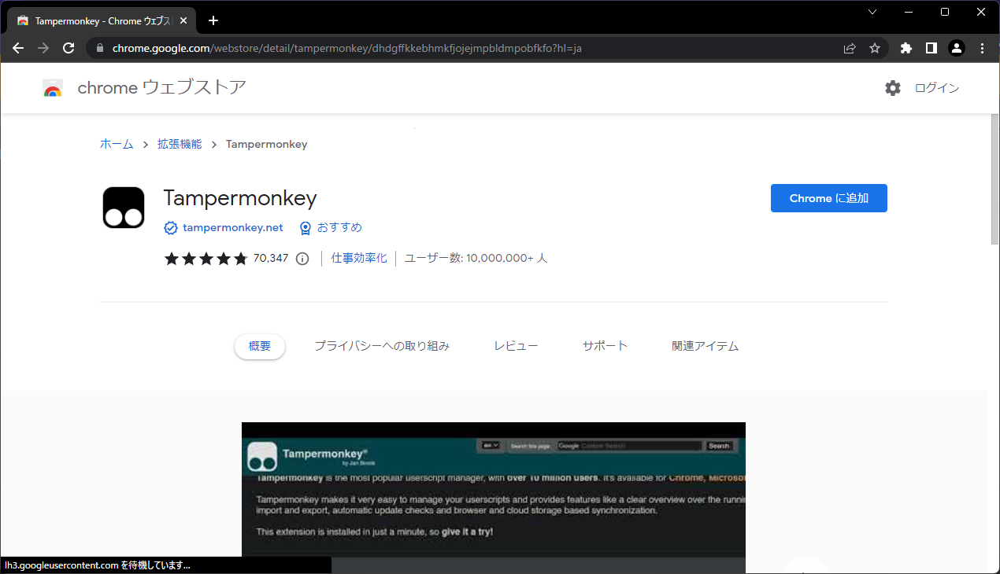


Tampermonkeyのダッシュボードを開きます。
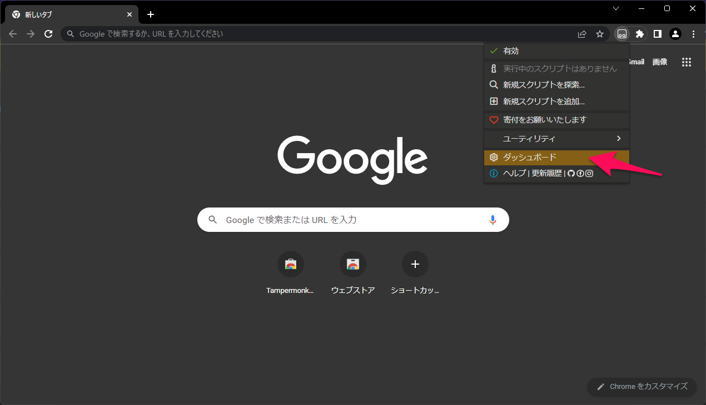


「ユーティリティ」タブを開いて、「URLからインポート」に、以下のURLを入力してインストールします。

```
https://raw.githubusercontent.com/motoacs/amazon-seller-filter-checker/master/amazon-seller-filter-checker.user.js
```

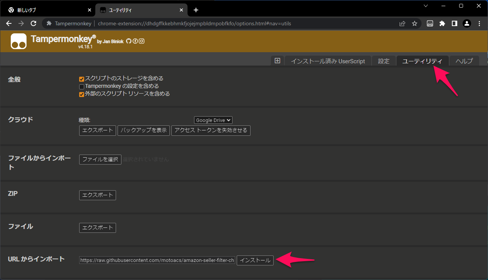


### AdGuard

AdGuardの設定を開き、「拡張機能」→「拡張機能を追加」をクリックします。
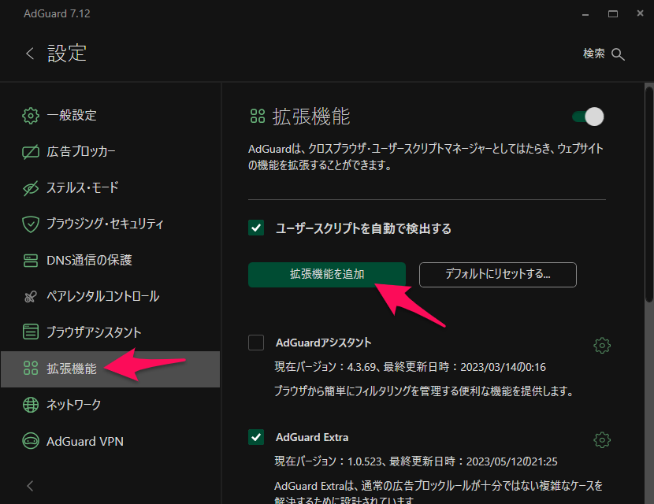


以下のURLを入力して、「インストール」をクリックします。

```
https://raw.githubusercontent.com/motoacs/amazon-seller-filter-checker/master/amazon-seller-filter-checker.user.js
```

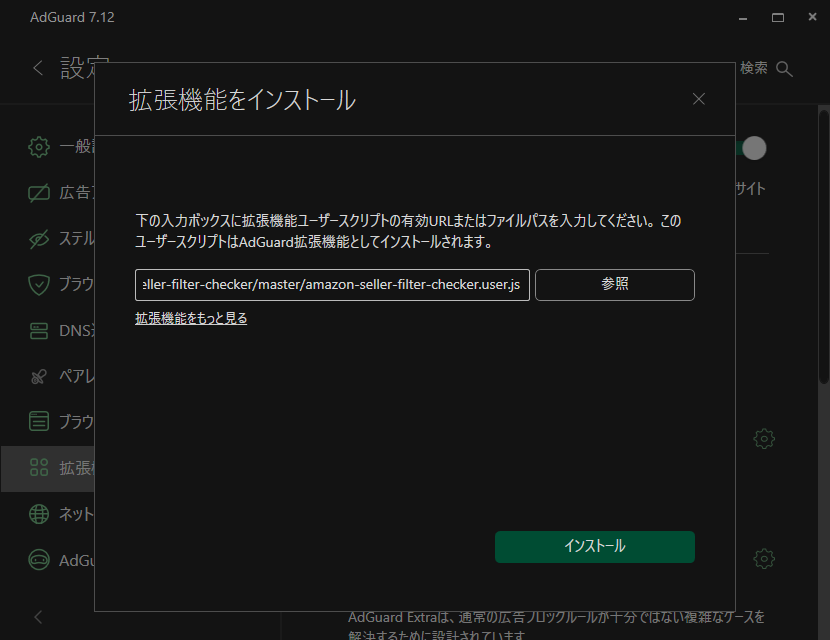


確認して「インストール」をクリックします。
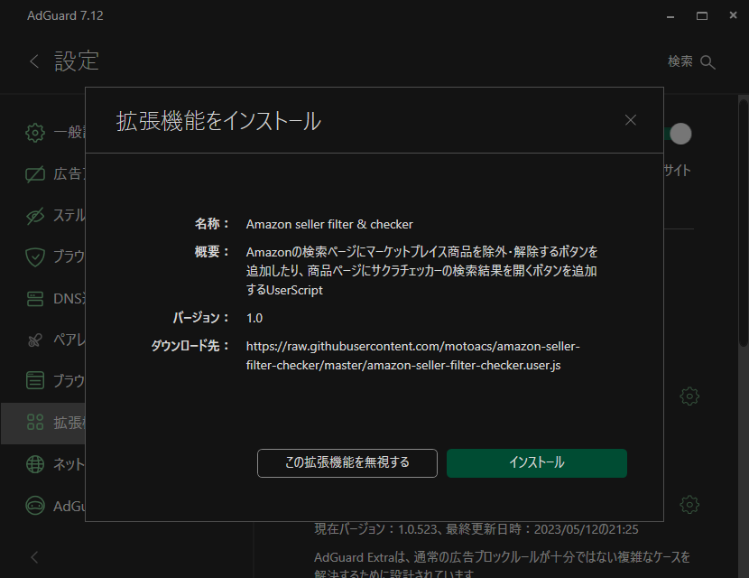
